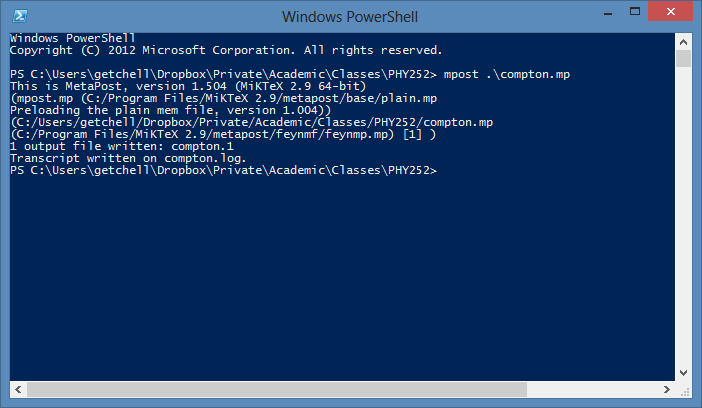
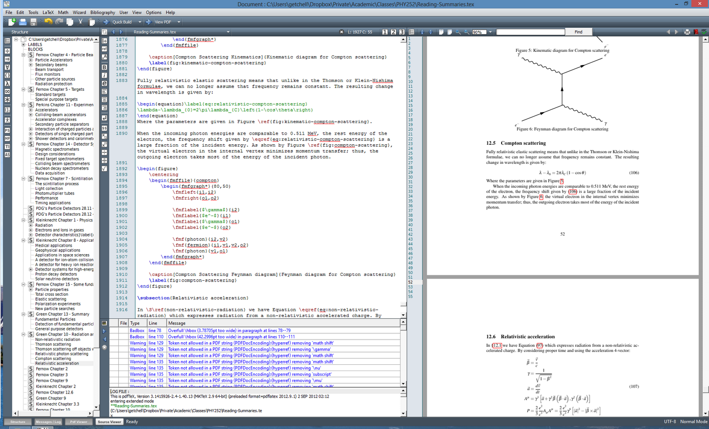

Title: Feynman diagrams in LaTeX
Date: 2012-09-02 09:15
Author: Adam Getchell (noreply@blogger.com)
Tags: latex, field theory
Slug: feynman-diagrams-in-latex
Category: Physics

Sometimes you need Feynman diagrams in papers. It turns out there are
quite a few ways to get there, but the handiest is FeynMP. I'm using, in
particular, MikTeX and TeXMaker, but something like this should work for
other setups. Here are the steps:  

First, get the **feynmf** package from your package manager.

Next, add the following to your $\LaTeX$ preamble: I know the package
name says **feynmp**; if you use that, you'll have a lot more errors.
The feynmp package is nicer, and included when you install feynmf.

[gist:id=3595449,file=feynmp-preamble.tex]  

Now, let's say you want to add a diagram for Compton scattering (the
point of the whole exercise). I suggest wrapping it in a $\LaTeX$
figure for convenience; doing so will lead to something like this:

[gist:id=3595628,file=compton.tex]

Note the name of the file is compton. In your $\LaTeX$ working directory,
there will be a file called compton.mp. You need to run the mpost
command on it, like so:  

This generates compton.1. Now, compile your $\LaTeX$ (are you getting
tired of the cute capitalization yet?) file again, and your diagram will
appear!

Note that you'll have to do this anytime you edit the figure (e.g. add
labels, etc.)  

But if you think this is a pain, try the alternatives!  

Here's a post that set me on the
track: <http://physical-thought.blogspot.com/2008/08/feynmf-feynman-diagrams-in-latex.html>  

Here's the details on getting your preamble
correct: <http://tex.stackexchange.com/questions/20241/how-to-use-kile-with-feynmf-or-feynmp>  

Here's a quick tutorial on using
feyMP: <http://suppiya.files.wordpress.com/2008/02/fmfsamples.pdf>  

Here's a more in-depth tutorial by Thorsten Ohl, the author of
feynMP/feynMF: <http://xml.web.cern.ch/XML/textproc/feynmf.html>  

Here's a quicker tutorial by Thorsten
Ohl, <https://docs.google.com/viewer?url=http://www-zeus.desy.de/~kind/latex/feynmf/fmfcnl3.ps&pli=1>  

And here's the actual
manual: <http://www.pd.infn.it/TeX/doc/latex/feynmf/manual.pdf>  

Also, while we're on the topic, this site had a lot of invaluable tips
for formatting math
symbols: <http://www.math.uiuc.edu/~hildebr/tex/displays.html>  

I hope this shortens the learning curve for someone else! If you have
any feedback or corrections, send notes or pull requests to the gists.  

Happy $\LaTeX$-ing!

